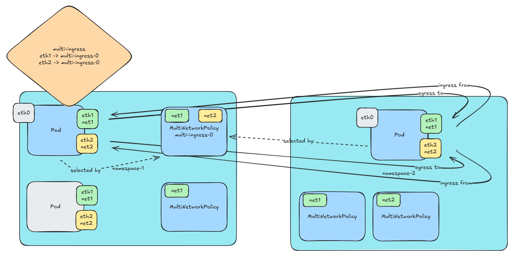

# multi-networkpolicy-nftables
[](https://github.com/telekom/multi-networkpolicy-nftables/actions/workflows/build.yml)[](https://github.com/telekom/multi-networkpolicy-nftables/actions/workflows/test.yml)

[multi-networkpolicy](https://github.com/telekom/multi-networkpolicy) implementation with nftables

## Current Status of the Repository

It is now actively developping hence not stable yet. Bug report and feature request are welcome.

## Description

Kubernetes provides [Network Policies](https://kubernetes.io/docs/concepts/services-networking/network-policies/) for network security. Currently net-attach-def does not support Network Policies because net-attach-def is CRD, user defined resources, outside of Kubernetes.
multi-network policy implements Network Policiy functionality for net-attach-def, by nftables and provies network security for net-attach-def networks.




## Quickstart

Install MultiNetworkPolicy CRD into Kubernetes.

```
$ git clone https://github.com/k8snetworkplumbingwg/multi-networkpolicy
$ cd multi-networkpolicy
$ kubectl create -f scheme.yml
customresourcedefinition.apiextensions.k8s.io/multi-networkpolicies.k8s.cni.cncf.io created
```

Deploy multi-networkpolicie-nftables into Kubernetes.

```
$ git clone https://github.com/telekom/multi-networkpolicy-nftables
$ cd multi-networkpolicy-nftables
$ kubectl create -f deploy.yml
clusterrole.rbac.authorization.k8s.io/multi-networkpolicy created
clusterrolebinding.rbac.authorization.k8s.io/multi-networkpolicy created
serviceaccount/multi-networkpolicy created
daemonset.apps/multi-networkpolicy-ds-amd64 created
```

## Requirements

This project leverages `nftables` hence the netfilter module need to be loaded on the container host:

```
# modprobe nf_ct
# modprobe nf_tables
```

## Configurations

See [Configurations](docs/configurations.md).

## Demo

(TBD)

### MultiNetworkPolicy DaemonSet

MultiNetworkPolicy creates DaemonSet and it runs `multi-networkpolicy-nftables` for each node. `multi-networkpolicy-nftables` watches MultiNetworkPolicy object and creates nftables rules into 'pod's network namespace', not container host and the nftables rules filters packets to interface, based on MultiNetworkPolicy.

## TODO

* Bugfixing
* (TBD)

## Contact Us

For any questions about Multus CNI, feel free to ask a question in #general in the [NPWG Slack](https://npwg-team.slack.com/), or open up a GitHub issue. Request an invite to NPWG slack [here](https://intel-corp.herokuapp.com/).
